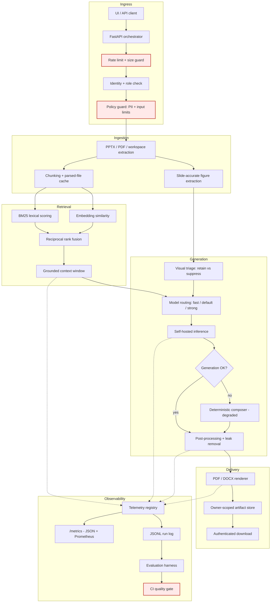

# DocSynth — Enterprise Multi-Modal Document Synthesis Engine involving Hybrid RAG, Telemetry

Turn raw enterprise content — slide decks, PDFs, workspace files, and embedded figures — into publication-ready documentation that stays grounded in its sources, and prove the output quality on every commit.


**Jump to:** [Problem](#1-the-problem) · [Architecture](#3-architecture) · [Quality](#5-quality-engineering) · [Operations](#6-production-operations) · [Evidence](#8-evidence) · [Quickstart](#9-quickstart)

---

## 1. The problem

Enterprise knowledge is trapped in decks. A 140-slide architecture deck contains the information a reference document needs, but converting it costs an engineer days of manual work — and the result is inconsistent, unattributed, and stale within a sprint.

The obvious fix — paste it into a chatbot — fails on three counts that matter in a real organisation:

| Failure | Consequence |
|---|---|
| **The content cannot leave the boundary** | Unreleased roadmaps and incident data cannot be sent to a third-party API. The project dies in data-transfer review. |
| **The output cannot be trusted** | An unattributed, confidently wrong paragraph in published documentation is worse than no documentation. |
| **Quality cannot be measured** | "It looks good" does not survive contact with a second reviewer, let alone a release process. |

DocSynth is built around those three constraints rather than around the model.

---

## 2. What it does

```
Slide decks / PDFs / workspace files  ──▶  Publication-ready PDF + DOCX
        (raw, unstructured, noisy)              (grounded, structured, audited)
```

| Capability | What it means in practice |
|---|---|
| **Grounded synthesis** | Hybrid BM25 + embedding retrieval selects source chunks; every generated statement is anchored to retrieved context, and the sources are returned with the response. |
| **Multi-modal ingestion** | Slide-accurate figure extraction from PPTX via slide relationships, PDF text extraction, and vision-model text recovery from images. |
| **Visual triage** | Informative diagrams are retained and captioned; decorative clipart and layout chrome are suppressed, with the decision breakdown recorded. |
| **Publication rendering** | PDF and DOCX with headings, captions, inline figures, and tables — not a wall of text. |
| **Content integrity** | Post-processing strips slide references, meeting chatter, roster names, and raw markup. Leak counts are a gated metric, not a hope. |
| **Measured quality** | 50+ KPIs per run, a 12-case golden regression set, and versioned thresholds that fail the build. |
| **Graceful degradation** | If the inference tier is unavailable, a deterministic composer produces a grounded document and the run is recorded as degraded — never dropped. |

---

## 3. Architecture



### Layer ownership

| Layer | Responsibility | Implementation |
|---|---|---|
| Ingress protection | Rate limiting, body size guards, CORS | [ingress.py](services/orchestrator/app/ingress.py) |
| Identity & policy | Role checks, PII detection, input limits | [security.py](services/orchestrator/app/security.py), [policy.py](services/orchestrator/app/policy.py) |
| Ingestion | PPTX/PDF parsing, chunking, figure extraction | [workspace_context.py](services/orchestrator/app/workspace_context.py) |
| Retrieval | Hybrid ranking and context assembly | [retrieval.py](services/orchestrator/app/retrieval.py) |
| Retrieval eval | Recall / MRR / nDCG benchmarking | [retrieval_eval.py](services/orchestrator/app/retrieval_eval.py) |
| Visual triage | Figure retention vs suppression | [image_intelligence.py](services/orchestrator/app/image_intelligence.py) |
| Orchestration | Routing, generation, jobs, API surface | [main.py](services/orchestrator/app/main.py) |
| Rendering | PDF/DOCX with figures, captions, tables | [document_builder.py](services/orchestrator/app/document_builder.py) |
| Telemetry | KPI capture, aggregation, exposition | [telemetry.py](services/orchestrator/app/telemetry.py) |
| Evaluation | Golden set, scoring, quality gate | [run_eval.py](pipelines/eval/run_eval.py) |

### Why it is built this way

Structural decisions are recorded as ADRs — including the ones that were *rejected* and why:

| ADR | Decision |
|---|---|
| [0001](docs/adr/0001-hybrid-retrieval-over-pure-vector-search.md) | Hybrid BM25 + embeddings, not pure vector search |
| [0002](docs/adr/0002-deterministic-fallback-over-hard-failure.md) | Degrade to a deterministic composer, never hard-fail |
| [0003](docs/adr/0003-rule-based-evaluation-over-llm-judge.md) | Rule-based quality gate, not an LLM judge |
| [0004](docs/adr/0004-in-process-rate-limiting.md) | In-process rate limiting as a per-replica backstop |
| [0005](docs/adr/0005-self-hosted-inference.md) | Self-hosted inference, not a managed API |
| [0006](docs/adr/0006-in-process-telemetry-over-otel-sdk.md) | Purpose-built telemetry registry, not the OTel SDK |
| [0007](docs/adr/0007-synchronous-and-async-compose-paths.md) | Both sync and async compose paths |

---

## 4. API surface

| Endpoint | Method | Purpose |
|---|---|---|
| `/compose` | POST | Synchronous document generation |
| `/compose/jobs` | POST | Async job submission (202 + job id) |
| `/compose/jobs/{id}` | GET | Job status |
| `/compose/jobs/{id}/result` | GET | Completed result, owner-scoped |
| `/optimize` | POST | Rewrite and polish existing text |
| `/artifacts/{id}` | GET | Artifact download, owner or admin only |
| `/benchmarks` | GET | Latest evaluation report with gate status |
| `/capabilities` | GET | Installed models and resolved vision model |
| `/metrics` | GET | KPI snapshot — JSON or `?format=prometheus` |
| `/healthz` | GET | Liveness — dependency-free by design |
| `/readyz` | GET | Readiness — artifact store + LLM, 503 when not ready |
| `/version` | GET | Version, git commit, build time, model routing, limits |
| `/ui/` | GET | Browser UI |

Full request/response examples: [docs/api-examples.md](docs/api-examples.md).

---

## 5. Quality engineering

> This is the part most AI portfolio projects skip.

Output quality is treated as a build artifact. A pull request that degrades generation quality fails CI **even when every unit test passes**.

### The gate

```
python pipelines/eval/run_eval.py --mode mock --gate
```

| Gate | Bound | Why this bound |
|---|---|---|
| `pass_rate` | ≥ 1.0 | An errored case is a functional regression |
| `avg_must_include_coverage` | ≥ 0.85 | Below this, output drops facts the author explicitly required |
| `min_case_must_include_coverage` | ≥ 0.5 | Stops one collapsed case hiding behind a good mean |
| `forbidden_term_rate` | = 0.0 | PII and leakage are release blockers, not trade-offs |
| `structure_compliance_rate` | ≥ 0.9 | Ordered steps and tables are requested explicitly |
| `length_compliance_rate` | ≥ 0.9 | Runaway length is the most common silent failure |
| `refusal_accuracy` | = 1.0 | A confident fabrication is the worst failure mode |
| `p95_latency_ms` | ≤ 120 s | Aligned with the full-deck SLO |

Thresholds live in [pipelines/eval/thresholds.json](pipelines/eval/thresholds.json), versioned in git, each with a written rationale. Raising a bar is a reviewed change with a changelog entry — it cannot be edited quietly.

### The golden set

12 hand-labelled cases chosen for the ways *this* product fails, not to inflate a count:

`executive_summary` · `status_report` · `procedure` · `risk_register` · `synthesis` · `compliance` · `grounding` · `hallucination_probe` · `structure` · `long_form` · `instruction_following` · `integrity`

Including an adversarial unanswerable question and a PII-redaction probe.

### Honest about its own limits

Five cases genuinely need a live model — refusal behaviour, PII redaction, table synthesis. In CI's model-free mode they are **scored and reported but excluded from the pass/fail decision**, and every report lists them under `advisory_case_ids`.

**The gate never claims more coverage than it has.** A gate that is green by construction is worse than no gate.

The harness itself is unit-tested ([test_evaluation.py](services/orchestrator/tests/test_evaluation.py)) — a gate nobody tests is a gate nobody should trust.

Full methodology: [docs/evaluation-framework.md](docs/evaluation-framework.md).

---

## 6. Production operations

### Reliability

- **Liveness vs readiness are deliberately different.** `/healthz` touches no dependency — a failing LLM must never make Kubernetes restart a healthy pod and turn a dependency outage into a crash loop. `/readyz` checks the artifact store and inference tier and returns 503 to leave the load-balancer rotation while staying alive to recover.
- **Startup probe** absorbs cold model loads so a slow first boot never trips liveness.
- **preStop drain + 60s grace period** lets in-flight compose requests finish before termination.
- **Graceful degradation** keeps the service returning grounded output when inference is unavailable.

### Security

| Control | Implementation |
|---|---|
| Identity & RBAC | `X-User-Id` / `X-User-Role` with a configurable role allow-list |
| Object-level authorisation | Artifacts and jobs are owner-scoped; admin override is explicit |
| Rate limiting | Per-identity sliding window with `Retry-After` and `X-RateLimit-*` |
| Request size guard | HTTP 413 before the generation pipeline is entered |
| CORS | Opt-in, origin-allow-listed, never wildcard with credentials |
| Data residency | Self-hosted inference; outbound internet disabled by default |
| Policy guards | PII detection and input limits on every request |
| Container hardening | Multi-stage build, non-root UID 10001, dropped capabilities, read-only root filesystem, `no-new-privileges`, HEALTHCHECK, OCI provenance labels |
| Supply chain | `pip-audit`, `bandit`, CodeQL, Trivy image scanning, gitleaks, Dependabot |

### Observability

Structured JSON request logs · `X-Request-Id` correlation · 50+ KPIs per run · JSONL run log · JSON and Prometheus exposition · build provenance on `/version`.

SLOs, error budgets, alert rules, dashboard layout, and a failure-analysis playbook: [docs/slo-and-observability.md](docs/slo-and-observability.md).

Known gaps are stated explicitly rather than implied by omission — most notably, there is no distributed tracing yet ([ADR-0006](docs/adr/0006-in-process-telemetry-over-otel-sdk.md)).

### Scalability and cost

| Concern | Approach |
|---|---|
| Expensive repeat prompts | Disk-backed LLM response cache |
| Repeated file parsing | Parsed workspace file cache with hit/miss metrics |
| Long jobs | Async job path with disk-persisted state ([ADR-0007](docs/adr/0007-synchronous-and-async-compose-paths.md)) |
| Cost control | Model routing by detail level: fast / default / strong |
| Horizontal scale | Stateless replicas, HPA, shared artifact volume |
| Load shedding | Rate limit + size guard before any expensive work |

---

## 7. CI/CD

Every pull request runs:

| Job | Gate |
|---|---|
| `lint` | ruff lint + format check, mypy |
| `test` | 132 tests across Ubuntu/Windows × Python 3.11/3.12 |
| `coverage` | Branch coverage with an enforced floor |
| `quality-gate` | Golden-set evaluation against committed thresholds + baseline diff |
| `smoke-doc-build` | Real PDF/DOCX render from a representative deck |
| `container` | Image build, liveness probe, endpoint checks, non-root assertion |
| `security` | pip-audit, bandit, CodeQL, Trivy, gitleaks |

Reproduce the entire pipeline locally in one command:

```powershell
make check          # or: pwsh -File scripts/check.ps1
```

---

## 8. Evidence

Real committed output, regenerable with one command — see [examples/](examples/README.md).

| Artifact | What it demonstrates |
|---|---|
| [sample-input-raw.txt](examples/sample-input-raw.txt) | Raw deck extraction: slide numbers, action items, meeting chatter |
| [sample-output-synthesised.md](examples/sample-output-synthesised.md) | The publication-ready result |
| [sample-technical-reference.pdf](examples/sample-technical-reference.pdf) | Rendered PDF |
| [sample-technical-reference.docx](examples/sample-technical-reference.docx) | Rendered DOCX |
| [manifest.json](examples/manifest.json) | Integrity and structure analysis of the output |
| [last_eval_report.json](pipelines/eval/last_eval_report.json) | Every gate check, per-case scores, advisory disclosure |

**Measured on the committed sample** — these are fields in `manifest.json`, produced by the same `analyze_document` function that runs in production, not README claims:

| Signal | Value |
|---|---:|
| Slide references leaked | 0 |
| Meeting chatter leaked | 0 |
| Roster/name references leaked | 0 |
| Raw markup leaked | 0 |
| Content integrity check | pass |
| Loose measurements structured into tables | 1 table, 3 rows |

**Verified on a live full-deck run:**

| Metric | Value |
|---|---:|
| Generated output length | 156,002 chars |
| Retrieval top score | 1.0 |
| Retrieval avg top score | 0.9453 |
| Retrieval latency | 4.59 s |
| Compose success rate | 100% |
| Leaks detected | 0 |
| Clean-document rate | 1.0 |

**Repository quality:**

| Signal | Value |
|---|---:|
| Tests | 132 passing |
| Branch coverage | 83% (floor enforced at 75%) |
| Type checking | mypy clean, strict-ish config |
| Security scan | bandit clean |
| Golden regression cases | 12 |
| KPIs tracked per run | 50+ |
| ADRs recorded | 7 |

---

## 9. Quickstart

### Local

```powershell
git clone <repo-url>
cd "Agentic Doc automation"

python -m venv .venv
.\.venv\Scripts\Activate.ps1
pip install -r services\orchestrator\requirements-dev.txt

Copy-Item .env.example .env
uvicorn services.orchestrator.app.main:app --host 127.0.0.1 --port 8080
```

Open <http://127.0.0.1:8080/ui/>.

### Docker

```powershell
docker compose -f deploy/docker-compose.yml up --build
```

### Kubernetes

```powershell
kubectl apply -f deploy/k8s/namespace.yaml
kubectl apply -f deploy/k8s/
```

### Verify the install

```powershell
curl http://127.0.0.1:8080/healthz
curl http://127.0.0.1:8080/version
curl "http://127.0.0.1:8080/metrics?format=prometheus"
```

### Example compose request

```powershell
$headers = @{ 'X-User-Id' = 'user-001'; 'X-User-Role' = 'author' }
$body = @{
  document_id          = 'demo-deck'
  user_prompt          = 'Describe the deck in a publication-ready document.'
  objective            = 'Generate a complete reference document from the deck.'
  domain               = 'enterprise platform'
  detail_level         = 'full_deck'
  output_formats       = @('pdf')
  workspace_file_hints = @('Sandbox environment.pptx')
  max_workspace_docs   = 4
} | ConvertTo-Json -Depth 12

Invoke-RestMethod -Uri 'http://127.0.0.1:8080/compose' -Method Post `
  -Headers $headers -ContentType 'application/json' -Body $body
```

---

## 10. Repository layout

```text
.
├── services/orchestrator/     # The service
│   ├── app/                   #   ingress, retrieval, triage, generation, render, telemetry
│   ├── tests/                 #   132 tests
│   └── scripts/               #   validation and inspection tools
├── pipelines/
│   ├── eval/                  # Golden set, thresholds, quality gate, committed report
│   └── ml/                    # Ranker training
├── deploy/
│   ├── docker-compose.yml     # Local stack
│   └── k8s/                   # Manifests, HPA, network policy
├── docs/
│   ├── adr/                   # Architecture Decision Records
│   ├── architecture.md
│   ├── evaluation-framework.md
│   ├── slo-and-observability.md
│   └── runbook-*.md
├── examples/                  # Committed demo evidence
├── scripts/                   # check.ps1, generate_demo_assets.py
├── pyproject.toml             # ruff, mypy, pytest, coverage, bandit
├── Makefile                   # make check == CI
└── .github/workflows/         # ci.yml, security.yml
```

---

## 11. Documentation

| Document | Contents |
|---|---|
| [architecture.md](docs/architecture.md) | System flow and component responsibilities |
| [adr/](docs/adr/README.md) | Why each structural decision was made, and what was rejected |
| [evaluation-framework.md](docs/evaluation-framework.md) | Metric definitions, scoring rules, gate policy |
| [slo-and-observability.md](docs/slo-and-observability.md) | SLIs, SLOs, error budgets, alerts, failure playbook |
| [rag-advanced-design.md](docs/rag-advanced-design.md) | Hybrid retrieval and chunk diversity design |
| [api-examples.md](docs/api-examples.md) | Request/response examples |
| [runbook-docker.md](docs/runbook-docker.md) · [runbook-kubernetes.md](docs/runbook-kubernetes.md) | Deployment runbooks |
| [testing-and-eval.md](docs/testing-and-eval.md) | Test strategy and eval harness usage |
| [compliance-checklist.md](docs/compliance-checklist.md) | Pre-production governance checklist |
| [troubleshooting-docker-k8s-windows.md](docs/troubleshooting-docker-k8s-windows.md) | Common environment issues |
| [CONTRIBUTING.md](CONTRIBUTING.md) | Local workflow and the quality bar |
| [CHANGELOG.md](CHANGELOG.md) | Release history |
| [SECURITY.md](SECURITY.md) | Vulnerability reporting |

---

## 12. Roadmap

Tracked honestly — these are known gaps, not aspirations.

- **Distributed tracing.** Request IDs propagate but spans are not exported. Blocking factor for multi-service debugging ([ADR-0006](docs/adr/0006-in-process-telemetry-over-otel-sdk.md)).
- **Cross-encoder reranking.** Deferred on latency budget; revisit if `recall@5` falls below 0.8 ([ADR-0001](docs/adr/0001-hybrid-retrieval-over-pure-vector-search.md)).
- **LLM judge as a non-blocking signal** alongside the deterministic gate.
- **Golden set growth** driven by real incidents rather than imagination.
- **A/B evaluation across model routes** to quantify the fast/default/strong trade-off.
- **Distributed job execution** once durability requirements exceed "survive a restart".

---

## License

[MIT](LICENSE).
