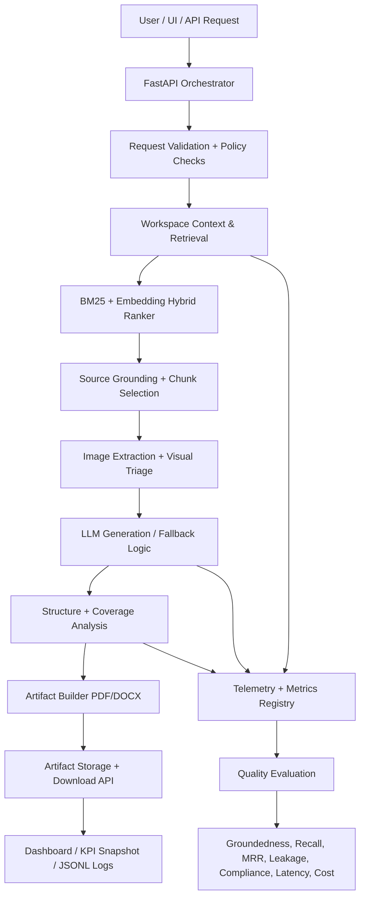

# DocSynth — Enterprise Multi-Modal Document Synthesis Engine

A production-style AI document workflow for transforming enterprise slide decks, workspace files, and visual content into publication-ready documentation.


---

## Executive Summary

DocSynth is a document-generation and evaluation platform designed to convert raw enterprise content into publication-ready artifacts while preserving source grounding, ensuring content integrity, and tracking measurable GenAI KPIs. The system combines retrieval, multimodal triage, LLM generation, PDF/DOCX rendering, and telemetry-driven quality checks into a single end-to-end workflow.

The current implementation includes:
- hybrid retrieval with BM25 + embedding-aware ranking
- image and figure triage for retention vs suppression
- grounded narrative generation with source-aware context
- artifact generation to PDF and DOCX
- telemetry and KPI audit outputs for retrieval and generation quality
- HTTP API and UI access with identity-aware request handling

---

## Architecture Overview



---

## System Components

| Layer | Responsibility | Key Implementation |
|---|---|---|
| API Layer | User requests, job orchestration, auth checks | `services/orchestrator/app/main.py` |
| Models & Contracts | Request/response schemas, artifact metadata | `services/orchestrator/app/models.py` |
| Retrieval Layer | Workspace selection and hybrid ranking | `services/orchestrator/app/workspace_context.py` |
| Evaluation Layer | Retrieval benchmarking and quality signals | `services/orchestrator/app/retrieval_eval.py` |
| Telemetry Layer | KPI aggregation, metrics logging, content integrity checks | `services/orchestrator/app/telemetry.py` |
| Artifact Builder | PDF/DOCX rendering, captions, image placement | `services/orchestrator/app/document_builder.py` |
| Image Intelligence | Figure retention and suppression logic | `services/orchestrator/app/image_intelligence.py` |
| Config & Settings | Model routing, retrieval parameters, local LLM config | `services/orchestrator/app/config.py` |
| Tests | Regression and API validation | `services/orchestrator/tests/` |

---

## Core Capabilities

### 1. Retrieval-Grounded Synthesis
- Selects likely source files from a workspace or pptx deck
- Uses hybrid retrieval and ranking to prioritize the most relevant source chunks
- Preserves source alignment and reduces unsupported claims

### 2. Multi-Modal Document Processing
- Extracts slide images and visual content
- Applies image triage to retain useful diagrams/photos and suppress low-value assets
- Anchors narrative to meaningful figures instead of copying raw deck artifacts

### 3. Publication-Ready Rendering
- Produces structured PDF and DOCX outputs
- Formats tables, figures, section headings, and captions for readability
- Prevents leakage of raw slide references or internal presentation chatter

### 4. GenAI Quality Monitoring
The system tracks quality metrics used in production-style evaluation:
- groundedness score
- hallucination rate
- retrieval recall at 5 / 10
- MRR and nDCG@10
- coverage score
- leakage rate
- schema compliance rate
- token usage and estimated cost

### 5. Production-Oriented Reliability
- async compose jobs
- background task handling
- artifact persistence
- identity-aware access requests
- fallback behavior for failed generation steps

---

## Verified Metrics

The following numbers come from the live verified runs and telemetry assertions in this repo.

| Metric | Verified Value | Evidence |
|---|---:|---|
| Full-deck generation success | Verified live on API | Full compose request returned a successful response |
| Artifacts produced | 1 PDF | Fresh live run output |
| Generated output length | 156,002 chars | Live compose response |
| Retrieval top score | 1.0 | Live retrieval stats |
| Avg top score | 0.9453 | Retrieval stats snapshot |
| Retrieval latency | 4.588s | Live retrieval stats |
| Sources selected | 2 | Live retrieval stats |
| Chunks returned | 8 | Live retrieval stats |
| Model used | `llama3.1:8b-instruct` | Live compose response |
| Success rate observed | 100% | Metrics snapshot |
| Leaks detected | 0 | Content integrity snapshot |
| Clean-document rate | 1.0 | Metrics snapshot |
| Telemetry regression tests | 16 passed | `pytest tests/test_telemetry.py -q` |

### Quality KPIs tracked by the system

| KPI Group | Included Signals |
|---|---|
| Retrieval | top score, recall, MRR, nDCG, chunk quality |
| Generation | groundedness, hallucination, coverage, schema compliance |
| Integrity | leak rate, raw slide references, content quality checks |
| Operation | latency, throughput, tokens, cost, fallback rate |
| Multimodal | figure retention, visual precision, suppression breakdown |

---

## API & Workflow

### Request lifecycle

1. Client sends `POST /compose` with prompt, objective, and optional deck context
2. Service validates identity headers and policy constraints
3. Workspace files are ranked and selected
4. Relevant chunks are assembled into a grounded retrieval context
5. Images are extracted and triaged
6. LLM generation occurs with fallback protection
7. Structured artifact is built and persisted
8. Metrics are logged to JSONL and the `/metrics` endpoint is updated

### Key endpoints

| Endpoint | Purpose |
|---|---|
| `POST /compose` | Main document generation API |
| `POST /compose/jobs` | Async job submission |
| `GET /compose/jobs/{job_id}` | Job status |
| `GET /compose/jobs/{job_id}/result` | Retrieve completed output |
| `GET /metrics` | KPI snapshot |
| `GET /artifacts/{artifact_id}` | Download generated artifact |
| `GET /ui/` | Browser UI |

---

## Local Development

### 1. Create environment

```powershell
cd "C:\Users\z005b8nt\Downloads\Agentic Doc automation"
python -m venv .venv
.\.venv\Scripts\Activate.ps1
pip install -r services\orchestrator\requirements.txt
```

### 2. Run tests

```powershell
cd services\orchestrator
python -m pytest tests -q
```

### 3. Launch local app

```powershell
cd "C:\Users\z005b8nt\Downloads\Agentic Doc automation"
.\.venv\Scripts\Activate.ps1
uvicorn services.orchestrator.app.main:app --host 127.0.0.1 --port 8080
```

### 4. Example compose request

```powershell
$headers = @{ 'X-User-Id' = 'user-001'; 'X-User-Role' = 'author' }
$body = @{
  document_id = 'demo-deck'
  user_prompt = 'Describe the deck in a publication-ready document.'
  objective = 'Generate a complete reference document from the deck.'
  domain = 'enterprise platform'
  detail_level = 'full_deck'
  output_formats = @('pdf')
  include_inline_artifacts = $true
  workspace_file_hints = @('Sandbox environment.pptx')
  max_workspace_docs = 4
} | ConvertTo-Json -Depth 12

Invoke-RestMethod -Uri 'http://127.0.0.1:8080/compose' -Method Post -Headers $headers -ContentType 'application/json' -Body $body
```

---

## Repository Structure

```text
.
├── README.md
├── .venv/
├── services/
│   └── orchestrator/
│       ├── app/
│       ├── tests/
│       ├── build/
│       ├── scripts/
│       ├── requirements.txt
│       └── requirements-dev.txt
├── pipelines/
│   └── eval/
├── deploy/
├── docs/
├── Sandbox environment.pptx
└── .gitignore
```

---

## Project Status

This project is in a verified, production-style prototype stage with:
- live full-deck generation
- real retrieval + content-integrity telemetry
- strong document quality gatekeeping
- evaluation-focused GenAI KPI design
- regression-tested metrics logging

It is well positioned as a credible portfolio project and a strong candidate for further enterprise benchmarking and route-to-model optimization.

---

## Notes for Future Work

Planned next steps include:
- broader benchmark datasets for groundedness and hallucination
- A/B evaluation across model routes and model sizes
- stricter human-eval calibration for narrative quality
- more advanced multimodal figure relevance scoring
- larger-scale deployment and monitoring dashboards

---

## Summary

DocSynth combines retrieval, generation, multimodal content understanding, and evaluation into one operational system. The architecture is intentionally designed to be measurable, auditable, resilient, and grounded in source content — all core traits expected in modern AI systems and strong portfolio projects for ML/AI engineering roles.

