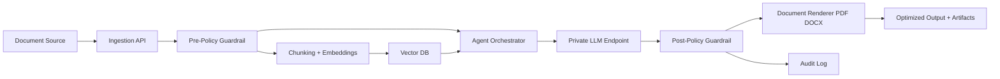

# Architecture Blueprint

## Core design goals

- Keep all data and model traffic inside private network
- Support policy-first processing (before and after AI)
- Enable scalable inference and orchestration on Kubernetes
- Keep components replaceable based on approved stack

## Logical flow

## Components

1. Ingestion API
- Receives input documents or text
- Normalizes encoding and metadata
- Enforces identity context from enterprise gateway headers

2. Policy Guardrail
- Detects sensitive fields/PII
- Enforces deny/allow/rewrite rules
- Blocks disallowed prompts and outputs

3. Embedding + Retrieval
- Generates embeddings with local model
- Stores/retrieves from self-hosted vector DB
- Uses hybrid scoring (lexical + embedding) with chunk-level ranking and citation metadata
- Caches parsed workspace documents to reduce repeated PDF/PPTX extraction latency
- Emits retrieval metrics such as selected files, chunks scored, cache hits, and retrieval latency

4. Agent Orchestrator
- Executes multi-step optimization chain
- Uses retrieval context and tools
- Produces structured output + confidence metadata

5. LLM Inference (Private)
- Uses approved model endpoint on internal GPU nodes
- No outbound internet calls

6. Audit Layer
- Captures request ID, user identity, policy decisions, model version, latency

7. Document Rendering Layer
- Converts optimized text into PDF and DOCX deliverables
- Returns binary artifacts in API response payload

8. Delivery Layer
- Supports downstream workflow routing and storage integration
- Preserves full traceability metadata for each generated document

9. Artifact Service
- Stores generated files and exposes secure artifact download endpoint
- Restricts retrieval to artifact owner or admin role

## Suggested technology options

- Orchestration: LangGraph / Semantic Kernel / Haystack
- API: FastAPI
- Vector DB: Qdrant / Milvus
- LLM host: vLLM / Ollama / TGI
- Policy checks: custom Python + Presidio (optional)
- Observability: OpenTelemetry + Prometheus + Grafana
